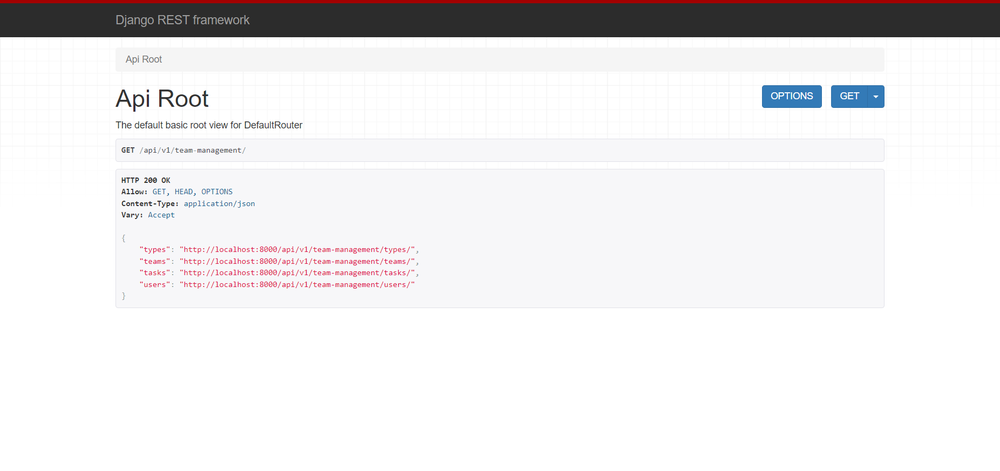
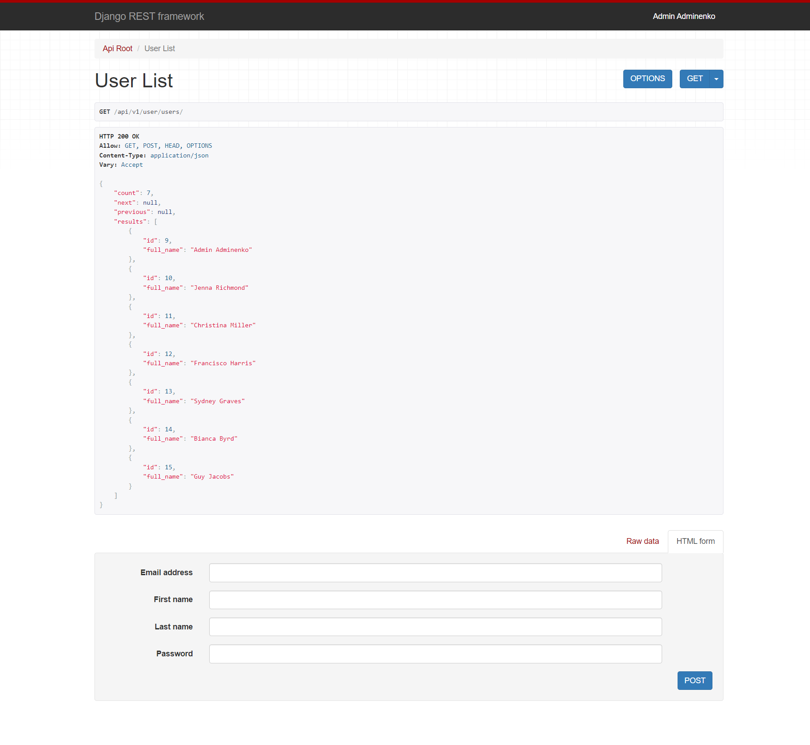
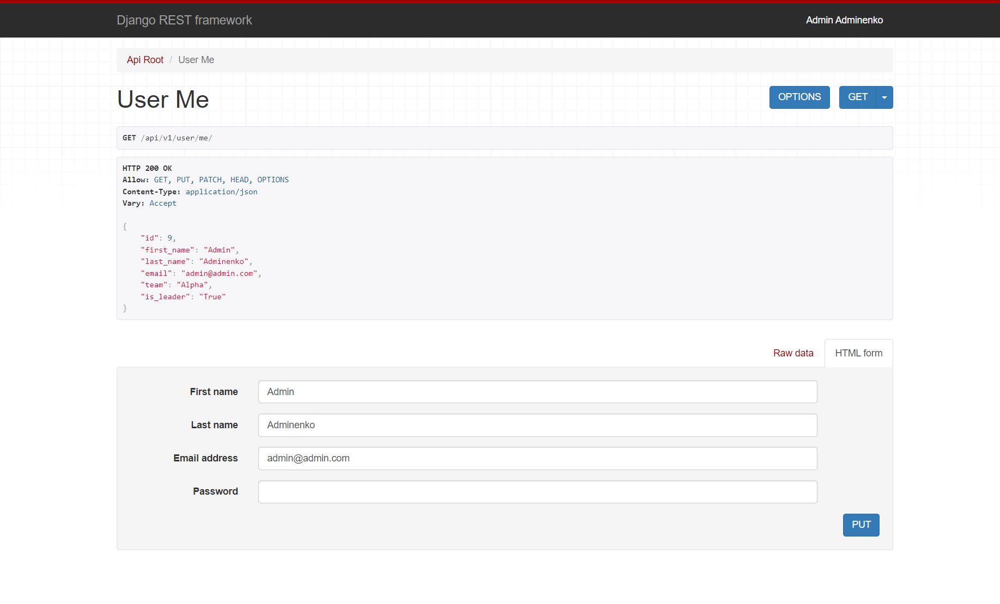
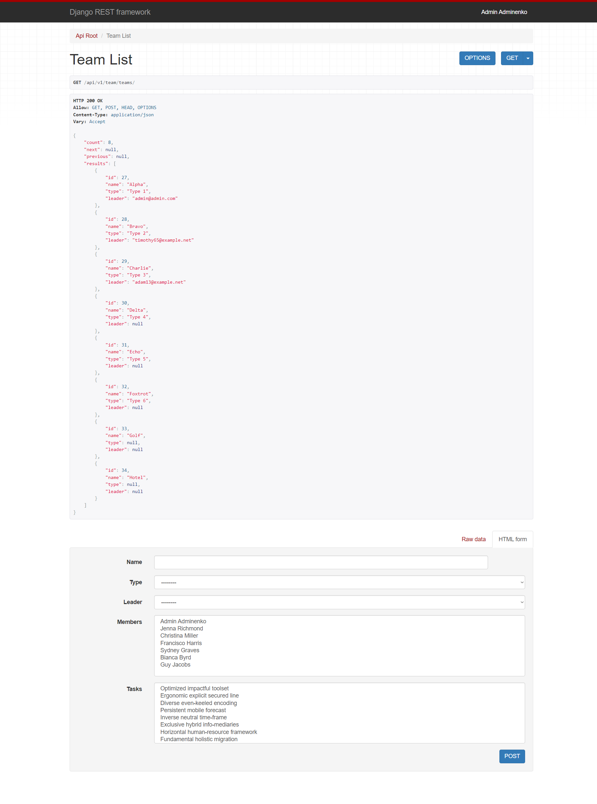
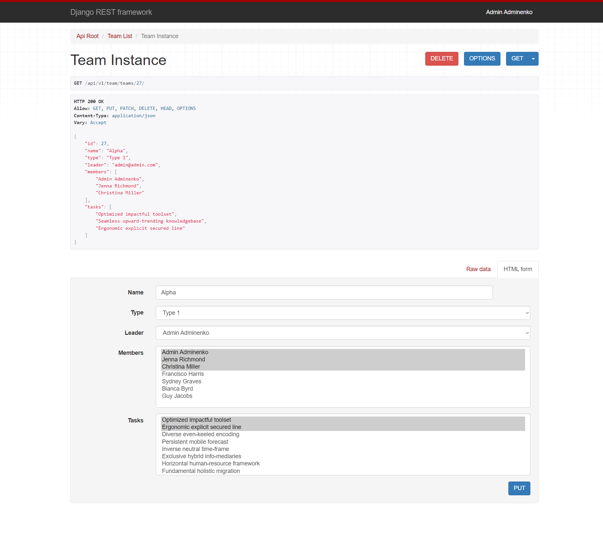
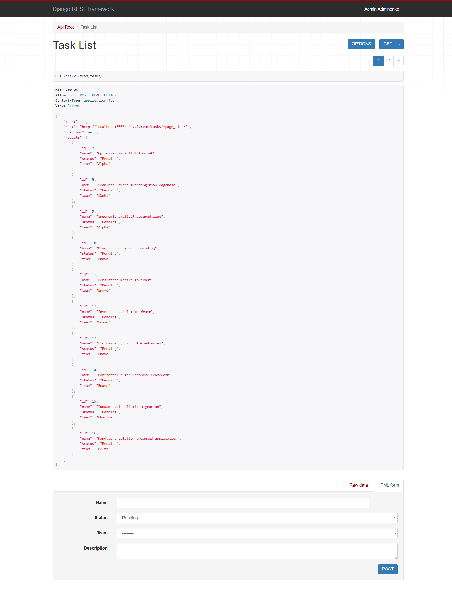
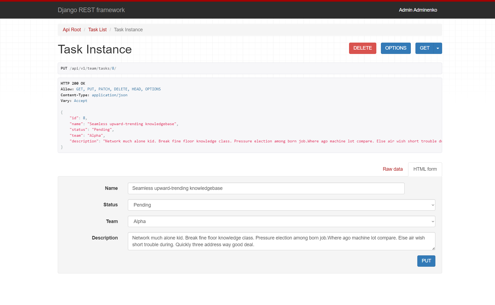
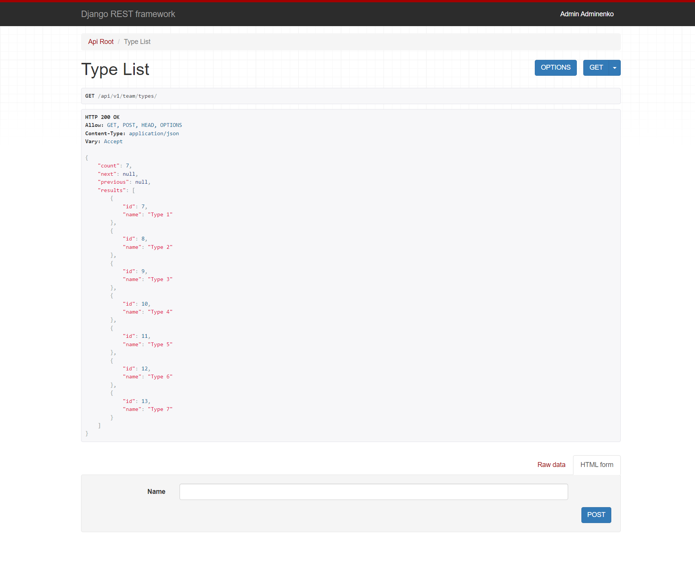
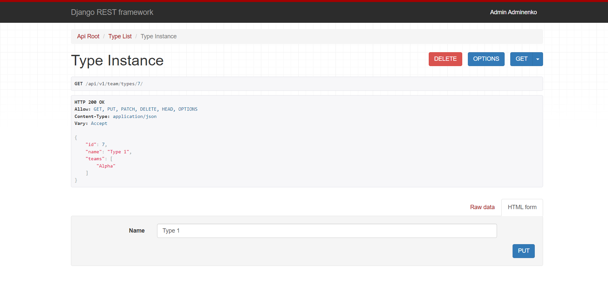

<div align="center">

# Team Management API 

</div>

<br>

<hr>

## Table of Contents

- [About Project](#about-project)
- [Application functional](#functional)
- [Technologies](#technologies)
- [Prerequisites](#prerequisites)
- [Setup](#setup)
- [Accessing the Application](#accessing-the-application)
- [Shutdown](#shutdown)
- [Demo](#demo)


<hr>

## About Project

The Team Management API is a robust and user-friendly solution 
built to empower organizations and project managers in 
efficiently handling teams and their tasks. <br>
It offers a wide range of features to manage teams, track member activities, and maintain real-time oversight of task progress.

<hr>

## Functional

- Use CRUD endpoints for teams, tasks and team types
  - staff required for not safe methods
  - team/task detail page is allowed only to related users
- JWT authentication
- Manage user accounts
  - staff required for create new user
  - user is able to change their profile <br>
  (email, password, name)
  


- Team leaders are also able to manage their team and tasks
<hr>

## Technologies

- [Django Rest Framework Official Documentation](https://www.django-rest-framework.org)
<br>`Django Rest Framework` is a powerful and flexible toolkit for building Web APIs. 
<br>In this project, it's used to create the backend service.


- [Postgres Official Documentation](https://www.postgresql.org/docs/)
<br>`Postgres` is a powerful, open-source object-relational database system. 
<br>In this project, it is used as the main data store, exposed on port 5432.
<hr>


## Prerequisites

1. Make sure you have Docker and Docker Compose installed on your system. 
You can check the installation instructions [here for Docker](https://docs.docker.com/get-docker/) 
and [here for Docker Compose](https://docs.docker.com/compose/install/).

<hr>

## Setup

1. Clone the project:
```
git clone https://github.com/diana-shyrokikh/team-management-api.git
```
2. Navigate to the project directory:
```
cd team-management-api
```
3. Build and run the Docker containers:
```
docker-compose build
docker-compose up
```

<hr>

## Accessing the Application

### Documentation is accessible at:
1. `http://localhost:8000/api/v1/doc/swagger/`
2. `http://localhost:8000/api/v1/doc/redoc/`

### API
1. Team Management API is accessible at `http://localhost:8000/api/v1/team-management/`
2. The Detailed Page for a specific resource is available at `http://localhost:8000/api/v1/team-management/<resource_name>/<id>/`
4. The Token Obtain Pair Page is accessible at `http://localhost:8000/api/v1/team-management/users/token/`
5. Token Refresh Page is accessible at `http://localhost:8000/api/v1/team-management/users/token/refresh/`
6. Django Admin Page is accessible at `http://localhost:8000/admin/`

<br>

Use these credentials to log in as an admin:

    Email: admin@admin.com
    Password: admin123456

<br>

Remember to replace `localhost` with the relevant IP address if you're not accessing these 
from the same machine where the services are running.

<br>

Please make sure to replace placeholders with your actual values in the `.env` file from the `.env.example`. 
Also, these instructions are subject to changes in the project, 
so always refer to the project's README or other documentation for the most accurate information.


## Shutdown

1. To stop running the server use CTRL-C


<hr>

## Demo











<hr>
